# Financial Data Platform -- Multi-Source Analytics Engineering on BigQuery

A production-grade analytics engineering project that demonstrates designing, modeling, and scaling a modern data environment for a global software organization. This project integrates financial data from five source systems into Google BigQuery, models the data through a Data Vault 2.0 raw vault into Kimball dimensional marts, enforces data quality via dbt-Elementary, orchestrates pipelines with Airflow on Cloud Run, and deploys end-to-end through GitHub Actions CI/CD.

---

## Table of Contents

- [Architecture Overview](#architecture-overview)
- [Technology Choices](#technology-choices)
- [Source Systems](#source-systems)
- [Data Modeling Approach](#data-modeling-approach)
- [Data Quality Framework](#data-quality-framework)
- [Project Structure](#project-structure)
- [Quick Start](#quick-start)
- [Deployment to GCP via GitHub Actions](#deployment-to-gcp-via-github-actions)
- [Data Model](#data-model)
- [Key Design Decisions](#key-design-decisions)

---

## Architecture Overview

```mermaid
flowchart TB
    subgraph SOURCES["📥 Source Systems"]
        QB["QuickBooks<br/>GL, Invoices, Payments"]
        STRIPE["Stripe<br/>Charges, Subscriptions"]
        SF["Salesforce<br/>Opportunities, Contracts"]
        NS["NetSuite<br/>Journal Entries, Accounts"]
        PLAID["Plaid<br/>Bank Transactions, Balances"]
    end

    subgraph INGESTION["🔄 Ingestion Layer"]
        FIVETRAN["Fivetran<br/>(Free Tier)"]
        PYTHON["Python Extractors<br/>(Cloud Run Jobs)"]
    end

    subgraph WAREHOUSE["🗄️ Google BigQuery"]
        RAW["RAW<br/>Landing Tables"]
        STAGING["STAGING<br/>Typed & Cleaned"]
        VAULT["VAULT<br/>Data Vault 2.0<br/>Hubs / Links / Satellites"]
        INT["INTERMEDIATE<br/>Golden Records<br/>& Entity Resolution"]
        MARTS["MARTS<br/>Star Schema<br/>Facts & Dimensions"]
        DQ["DATA QUALITY<br/>Elementary +<br/>Reconciliation Models"]
    end

    subgraph TRANSFORM["⚙️ Transformation"]
        DBT["dbt-core<br/>+ dbt-bigquery"]
        ELEMENTARY["dbt-Elementary<br/>Observability"]
    end

    subgraph ORCHESTRATION["🕐 Orchestration"]
        SCHEDULER["Cloud Scheduler<br/>(cron triggers)"]
        CLOUDRUN["Cloud Run Jobs<br/>(free tier)"]
        AIRFLOW["Airflow DAG<br/>(portable to Composer)"]
    end

    subgraph CICD["🚀 CI/CD"]
        GITHUB["GitHub Actions<br/>Lint → Test → Deploy"]
        TERRAFORM["Terraform<br/>IaC for GCP"]
    end

    subgraph BI["📊 Analytics"]
        PRESET["Preset<br/>(Free Tier)"]
    end

    %% Source → Ingestion
    QB -->|"REST API"| FIVETRAN
    STRIPE -->|"Events API"| FIVETRAN
    SF -->|"Bulk API"| FIVETRAN
    NS -->|"SuiteTalk TBA"| PYTHON
    PLAID -->|"Plaid API"| PYTHON

    %% Ingestion → Warehouse
    FIVETRAN -->|"Managed sync"| RAW
    PYTHON -->|"BigQuery load"| RAW

    %% Warehouse layers
    RAW --> STAGING
    STAGING --> VAULT
    VAULT --> INT
    INT --> MARTS
    MARTS --> DQ

    %% Transform orchestration
    DBT -.->|"builds"| STAGING
    DBT -.->|"builds"| VAULT
    DBT -.->|"builds"| INT
    DBT -.->|"builds"| MARTS
    ELEMENTARY -.->|"monitors"| DQ

    %% Orchestration
    SCHEDULER -->|"triggers daily"| CLOUDRUN
    CLOUDRUN -->|"runs"| PYTHON
    AIRFLOW -.->|"orchestrates"| FIVETRAN
    AIRFLOW -.->|"orchestrates"| DBT

    %% CI/CD
    GITHUB -.->|"deploys"| CLOUDRUN
    GITHUB -.->|"deploys"| DBT
    TERRAFORM -.->|"provisions"| WAREHOUSE

    %% BI
    MARTS -->|"connects"| PRESET
```



---

## Technology Choices

Each technology was selected for a specific reason, not to check a box.

| Layer | Technology | Why This Over Alternatives |
|---|---|---|
| **Warehouse** | BigQuery | Serverless, native GCP integration, scales without tuning |
| **Ingestion (SaaS)** | Fivetran | Managed connectors for QuickBooks, Stripe, Salesforce eliminate maintenance burden. The right tool for well-supported APIs. |
| **Ingestion (Custom)** | Python extractors | NetSuite SuiteTalk and Plaid have poor connector support. Custom Python with retry logic and pagination gives full control. |
| **Transformation** | dbt-core + dbt-bigquery | Industry standard for SQL-based ELT. Modular, testable, version-controlled. |
| **Raw Vault** | Data Vault 2.0 | Multi-source ingestion with full audit history. Absorbs schema changes without reprocessing. The right pattern when sources outnumber consumers. |
| **Marts** | Kimball star schema | BI tools expect denormalized facts and dimensions. Star schema gives the best query performance and analyst experience. |
| **Data Quality** | dbt-Elementary | Native dbt integration, anomaly detection, lineage-aware test dashboard. One tool instead of two. |
| **Orchestration** | Airflow on Cloud Run | Self-hosted Airflow on GCP free tier. DAG-based scheduling with BigQuery and Cloud Run operators. |
| **CI/CD** | GitHub Actions | PR-based testing, automated deployment, no additional platform needed. |
| **Infrastructure** | Terraform | Reproducible GCP provisioning (BigQuery, IAM, Cloud Run, Scheduler). |
| **BI** | Preset | Free-tier BI platform (Apache Superset hosted). Connects directly to BigQuery marts. |

**What I deliberately did not use:**

- **Apache Beam / Dataflow**: Overkill for batch API pulls. The source systems here are all REST APIs with manageable volumes -- Python extractors are simpler and easier to debug.
- **Great Expectations**: Redundant when Elementary already provides anomaly detection, test history, and observability. Running two quality frameworks adds complexity without proportional value.
- **GCP Composer**: Composer starts at ~$300/month with no free tier. For a demo project, Cloud Run Jobs triggered by Cloud Scheduler (both free tier) accomplish the same orchestration at zero cost. The Airflow DAG is included and portable to Composer for production use.
- **Looker**: No free tier. Preset (hosted Apache Superset) offers a free plan for up to 5 users and connects directly to BigQuery.

**Free tier / free tool for every component:**

| Component | Tool | Free Tier |
|---|---|---|
| Warehouse | BigQuery | 1 TB queries/month, 10 GB storage |
| Ingestion (SaaS) | Fivetran | 500K MAR/month, no credit card |
| Ingestion (Custom) | Python on Cloud Run Jobs | 2M requests/month |
| Transformation | dbt-core | Open source |
| Data Quality | dbt-Elementary | Open source |
| Orchestration | Cloud Scheduler + Cloud Run | 3 jobs free + 2M invocations |
| CI/CD | GitHub Actions | Free for public repos |
| Infrastructure | Terraform | Open source |
| BI | Preset | Free for up to 5 users |
| Secrets | GCP Secret Manager | 6 active versions free |
| Container Registry | Artifact Registry | 500 MB free |

---

## Source Systems

This project simulates a global software company with financial data spread across five systems. **Every source system has a free sandbox or developer account** -- no paid subscriptions required to demo the full pipeline.

| System | Data Domain | Ingestion | Free Access | Setup |
|---|---|---|---|---|
| **Stripe** | Charges, refunds, payouts, subscriptions | Fivetran | Free sandbox with test API keys, test cards, no credit card required | [stripe.com/docs/testing](https://stripe.com/docs/testing) |
| **QuickBooks** | GL, invoices, bills, payments | Fivetran | Free developer sandbox at Intuit Developer Portal, valid for life | [developer.intuit.com](https://developer.intuit.com) |
| **Salesforce** | Opportunities, contracts, accounts | Fivetran | Free Developer Edition org with full API access, never expires | [developer.salesforce.com/signup](https://developer.salesforce.com/signup) |
| **Plaid** | Bank transactions, balances | Python (Plaid API) | Free sandbox with test credentials (`user_good` / `pass_good`), unlimited test Items | [plaid.com/docs/sandbox](https://plaid.com/docs/sandbox/) |
| **NetSuite** | Journal entries, chart of accounts, vendors | Python (SuiteTalk REST) | Free developer account with SuiteScript, SuiteTalk API access | [netsuite.folio3.com](https://netsuite.folio3.com/blog/what-is-netsuite-developer-account-a-complete-guide/) |

Each source lands in its own `raw_*` dataset in BigQuery with a `_loaded_at` metadata column for freshness tracking.

### Demo Without Source Accounts

The `sample_data/` directory contains static JSON files that mimic real REST API responses from all 5 source systems. The data is **financially consistent across sources** -- the same customers, invoices, payments, and bank transactions cross-reference each other, which is what the entity resolution and reconciliation models validate.

To run the full pipeline locally:

1. **Load sample JSON** into BigQuery raw datasets (see `sample_data/README.md` for `bq load` commands)
2. **Run dbt** (`dbt seed && dbt build`) to process staging -> vault -> intermediate -> marts -> data quality
3. **Browse results** (`dbt docs generate && dbt docs serve`) to explore the lineage graph and column documentation

Even without loading sample data, the dbt project compiles and builds against empty tables, validating all SQL, dependencies, and tests.

---

## Data Modeling Approach

The modeling follows two patterns, each applied where it makes sense.

### Raw Vault (Data Vault 2.0)

The vault layer sits between staging and the business logic. It provides an **auditable, historized, source-system-agnostic** foundation.

| Component | Purpose | Examples |
|---|---|---|
| **Hubs** | Store unique business keys | `hub_customer`, `hub_account`, `hub_transaction` |
| **Links** | Capture relationships | `lnk_customer_account`, `lnk_transaction_account` |
| **Satellites** | Track attribute history with hash-diff change detection | `sat_customer_details`, `sat_customer_stripe`, `sat_account_balance` |

**When to use Vault:** When data arrives from many systems with different schemas and change rates, and you need full traceability. A global org adding a 6th or 7th source system next year can plug into the vault without refactoring anything downstream.

### Intermediate Layer (Entity Resolution)

The intermediate layer applies business rules to resolve the same entity across systems. This is where the golden customer record is built by matching on cross-system IDs, email addresses, and company name + postal code.

### Dimensional Marts (Kimball Star Schema)

The marts layer delivers analytics-ready tables for Preset (or any BI tool). Conformed dimensions with surrogate keys, fact tables at the transaction grain.

| Table | Grain | Description |
|---|---|---|
| `fct_transactions` | One row per financial event | Unified across all 5 sources with customer FK |
| `fct_revenue` | One row per revenue event | Recognized + pipeline with period dimensions |
| `fct_cash_flow` | One row per cash movement | Bank + accounting combined |
| `fct_accounts_receivable` | One row per invoice | AR aging with bucket classification |
| `dim_customers` | One row per golden customer | Lifetime metrics, tier, multi-source flag |
| `dim_accounts` | One row per chart-of-accounts entry | Classification, financial statement line |
| `dim_date` | One row per calendar day | Standard date spine 2020-2030 |

---

## Data Quality Framework

Data quality is handled by one tool (dbt-Elementary) applied consistently across every layer.

### dbt-Elementary

Elementary runs inside dbt and provides:

- **Anomaly detection** on row counts, freshness, and column distributions
- **Schema change alerts** when source tables add or drop columns
- **Test result history** and trend analysis over time
- **Hosted dashboard** for data observability without a separate platform

### dbt Schema Tests + dbt_expectations

Every model has schema-level tests defined in YAML:

- `not_null` / `unique` on all primary keys
- `accepted_values` on status fields, currency codes, classifications
- `relationships` between fact and dimension foreign keys
- `dbt_expectations.expect_column_values_to_be_between` on financial amounts
- `dbt_expectations.expect_column_values_to_match_regex` on emails

### Reconciliation Models

Purpose-built dbt models that surface cross-source discrepancies as queryable tables:

| Model | What It Checks |
|---|---|
| `dq_cross_source_reconciliation` | Accounting totals vs bank totals by day |
| `dq_golden_record_completeness` | Completeness score per customer record |
| `dq_source_freshness` | SLA compliance per source system |
| `dq_transaction_anomalies` | Z-score anomaly detection on daily transaction volumes |

### Custom Tests

| Test | Validation |
|---|---|
| `test_orphaned_transaction_rate` | < 5% of customer transactions lack a golden record match |
| `test_revenue_reconciliation` | Salesforce booked vs accounting recognized within 10% by quarter |
| `test_balanced_debits_credits` | Debits = credits within tolerance (generic, reusable) |

---

## Project Structure

```
gcp-airflow-dbt-fin-data/
|
├── README.md                         # This file
├── dbt_project.yml                   # dbt project configuration
├── packages.yml                      # dbt-utils, dbt_expectations, elementary
├── requirements.txt                  # Python dependencies
├── LICENSE                           # MIT license
├── Dockerfile.extractors             # Container for Python extractors
├── Dockerfile.dbt                    # Container for dbt runner
├── .env.example                      # Environment variable template
|
├── profiles/                         # dbt connection profiles
│   └── profiles_bigquery.yml
|
├── models/
│   ├── staging/                      # Source-aligned, light transformations
│   │   ├── _sources.yml
│   │   ├── stg_quickbooks/
│   │   │   ├── _stg_quickbooks__models.yml
│   │   │   ├── stg_quickbooks__invoices.sql
│   │   │   ├── stg_quickbooks__payments.sql
│   │   │   ├── stg_quickbooks__accounts.sql
│   │   │   └── stg_quickbooks__customers.sql
│   │   ├── stg_stripe/
│   │   │   ├── _stg_stripe__models.yml
│   │   │   ├── stg_stripe__charges.sql
│   │   │   ├── stg_stripe__customers.sql
│   │   │   └── stg_stripe__balance_transactions.sql
│   │   ├── stg_netsuite/
│   │   │   ├── _stg_netsuite__models.yml
│   │   │   ├── stg_netsuite__transactions.sql
│   │   │   └── stg_netsuite__accounts.sql
│   │   ├── stg_plaid/
│   │   │   ├── _stg_plaid__models.yml
│   │   │   ├── stg_plaid__transactions.sql
│   │   │   └── stg_plaid__balances.sql
│   │   └── stg_salesforce/
│   │       ├── _stg_salesforce__models.yml
│   │       ├── stg_salesforce__opportunities.sql
│   │       └── stg_salesforce__accounts.sql
│   │
│   ├── vault/                        # Data Vault 2.0
│   │   ├── hubs/
│   │   │   ├── hub_customer.sql
│   │   │   ├── hub_account.sql
│   │   │   └── hub_transaction.sql
│   │   ├── links/
│   │   │   ├── lnk_customer_account.sql
│   │   │   └── lnk_transaction_account.sql
│   │   └── satellites/
│   │       ├── sat_customer_details.sql
│   │       ├── sat_customer_stripe.sql
│   │       ├── sat_account_balance.sql
│   │       └── sat_transaction_details.sql
│   │
│   ├── intermediate/                 # Golden records, entity resolution
│   │   ├── _int_models.yml
│   │   ├── int_golden_customers.sql
│   │   ├── int_unified_transactions.sql
│   │   └── int_unified_chart_of_accounts.sql
│   │
│   └── marts/
│       ├── finance/                  # Kimball star schema
│       │   ├── _finance_models.yml
│       │   ├── fct_transactions.sql
│       │   ├── fct_revenue.sql
│       │   ├── fct_cash_flow.sql
│       │   ├── fct_accounts_receivable.sql
│       │   ├── dim_customers.sql
│       │   ├── dim_accounts.sql
│       │   └── dim_date.sql
│       │
│       └── data_quality/
│           ├── dq_cross_source_reconciliation.sql
│           ├── dq_golden_record_completeness.sql
│           ├── dq_source_freshness.sql
│           └── dq_transaction_anomalies.sql
|
├── macros/
│   ├── financial_helpers.sql
│   └── log_dbt_results.sql
|
├── seeds/
│   ├── seed_chart_of_accounts.csv
│   └── seed_currency_codes.csv
|
├── tests/
│   ├── generic/
│   │   └── test_balanced_debits_credits.sql
│   └── singular/
│       ├── test_orphaned_transaction_rate.sql
│       └── test_revenue_reconciliation.sql
|
├── snapshots/
│   └── snap_dim_customers.sql
|
├── docs/
│   └── data_dictionary.md
|
├── sample_data/                      # Static JSON mimicking API responses
│   ├── README.md                     # Cross-system entity map & usage
│   ├── stripe/
│   │   ├── charges.json              # GET /v1/charges (5 records)
│   │   ├── customers.json            # GET /v1/customers (5 records)
│   │   └── balance_transactions.json # GET /v1/balance_transactions (5 records)
│   ├── quickbooks/
│   │   ├── invoices.json             # QB query: Invoice (3 records)
│   │   ├── payments.json             # QB query: Payment (1 record)
│   │   ├── customers.json            # QB query: Customer (3 records)
│   │   └── accounts.json             # QB query: Account (8 records)
│   ├── salesforce/
│   │   ├── opportunities.json        # SOQL: Opportunity (5 records)
│   │   └── accounts.json             # SOQL: Account (5 records)
│   ├── netsuite/
│   │   ├── journal_entries.json      # SuiteTalk: journalEntry (4 records)
│   │   └── accounts.json             # SuiteTalk: account (10 records)
│   └── plaid/
│       ├── transactions.json         # POST /transactions/get (6 records)
│       └── balances.json             # POST /accounts/balance/get (2 accounts)
|
├── extractors/                       # Custom Python (NetSuite + Plaid only)
│   ├── common/
│   │   ├── api_client.py
│   │   └── bigquery_loader.py
│   ├── netsuite/extract.py
│   └── plaid/extract.py
|
├── orchestration/
│   └── dag_financial_pipeline.py     # Airflow DAG (runs on Cloud Run)
|
├── terraform/
│   ├── main.tf
│   ├── variables.tf
│   └── outputs.tf
|
├── scripts/
│   └── bootstrap.sh
|
└── .github/
    └── workflows/
        ├── ci.yml
        ├── deploy-infra.yml
        ├── deploy-extractors.yml
        ├── deploy-dbt.yml
        └── pipeline-daily.yml
```

---

## Quick Start

### Prerequisites

- Python 3.10+
- dbt-core 1.7+ with dbt-bigquery adapter
- Google Cloud project with BigQuery enabled

### Local Development

```bash
# 1. Clone the repository
git clone https://github.com/bgall1976/gcp-airflow-dbt-fin-data.git
cd gcp-airflow-dbt-fin-data

# 2. Create and activate virtual environment
python -m venv venv
source venv/bin/activate        # Windows: venv\Scripts\activate

# 3. Install dependencies
pip install -r requirements.txt

# 4. Configure dbt profile
mkdir -p ~/.dbt
cp profiles/profiles_bigquery.yml ~/.dbt/profiles.yml
# Edit ~/.dbt/profiles.yml with your BigQuery project ID

# 5. Authenticate to GCP
gcloud auth application-default login

# 6. Install dbt packages
dbt deps

# 7. Verify connection
dbt debug

# 8. Load seed data and build all models
dbt seed
dbt build

# 9. Generate documentation
dbt docs generate
dbt docs serve
```

**What this does:**
- Steps 1-3: Isolated Python environment with all dependencies
- Steps 4-5: Points dbt at your BigQuery project
- Step 6: Pulls in dbt-utils, dbt_expectations, and elementary packages
- Step 7: Validates BigQuery connectivity
- Step 8: Runs staging -> vault -> intermediate -> marts -> tests in dependency order
- Step 9: Produces a browsable DAG lineage and documentation site

### Windows (Command Prompt)

```cmd
git clone https://github.com/bgall1976/gcp-airflow-dbt-fin-data.git
cd gcp-airflow-dbt-fin-data
python -m venv venv
venv\Scripts\activate
python -m pip install --upgrade pip
python -m pip install -r requirements.txt
mkdir %USERPROFILE%\.dbt
copy profiles\profiles_bigquery.yml %USERPROFILE%\.dbt\profiles.yml
dbt deps
dbt debug
dbt seed
dbt build
```

---

## Deployment to GCP via GitHub Actions

### Workflows

| Workflow | Trigger | What It Does |
|---|---|---|
| `ci.yml` | Pull requests | Lints Python + SQL, compiles dbt, runs tests against ephemeral CI dataset |
| `deploy-infra.yml` | Push to `main` (terraform/) | Terraform apply: BigQuery datasets, IAM, WIF, Artifact Registry |
| `deploy-extractors.yml` | Push to `main` (extractors/) | Builds Docker image, deploys Cloud Run Jobs for NetSuite + Plaid |
| `deploy-dbt.yml` | Push to `main` (dbt_project/) + daily schedule | Seeds, builds all models, snapshots, uploads dbt docs to GCS |
| `pipeline-daily.yml` | Daily 6 AM UTC | Triggers Fivetran syncs + Cloud Run extractors, then dbt build |

### First-Time Setup

```bash
export GCP_PROJECT_ID=your-gcp-project
export GCP_REGION=us-east1
export GITHUB_REPO=bgall1976/financial-data-platform

./scripts/bootstrap.sh
```

This provisions all GCP infrastructure via Terraform, configures Workload Identity Federation for keyless GitHub-to-GCP auth, and sets GitHub secrets automatically.

### GitHub Secrets Required

| Secret | Description |
|---|---|
| `WIF_PROVIDER` | Workload Identity Federation provider (Terraform output) |
| `WIF_SERVICE_ACCOUNT` | GitHub Actions service account email |
| `PIPELINE_SERVICE_ACCOUNT` | Cloud Run Jobs service account email |

### GitHub Variables Required

| Variable | Description |
|---|---|
| `GCP_PROJECT_ID` | Google Cloud project ID |
| `GCP_REGION` | Region for Cloud Run and Artifact Registry |
| `TF_STATE_BUCKET` | GCS bucket for Terraform state |
| `DBT_DOCS_BUCKET` | GCS bucket for hosted dbt documentation |

---

## Data Model

### Fact Table: `fct_transactions`

Central fact table at the individual transaction grain. Joins unified transactions from all 5 source systems to the golden customer dimension.

| Column | Type | Description |
|---|---|---|
| `transaction_key` | STRING | Surrogate key (PK) |
| `source_transaction_id` | STRING | Original ID from source system |
| `customer_key` | STRING | FK to dim_customers |
| `date_key` | DATE | FK to dim_date |
| `transaction_type` | STRING | invoice, payment_received, bank_transaction |
| `transaction_category` | STRING | accounts_receivable, cash_receipt, cash_disbursement |
| `amount` | NUMERIC | Transaction amount in base currency (USD) |
| `cash_inflow` | NUMERIC | Derived: inflow portion |
| `cash_outflow` | NUMERIC | Derived: outflow portion |
| `revenue_amount` | NUMERIC | Derived: revenue portion |
| `source_system` | STRING | quickbooks, stripe, netsuite, plaid |

### Dimension: `dim_customers`

Entity-resolved golden customer record. Resolution priority: Salesforce > QuickBooks > Stripe.

| Column | Type | Description |
|---|---|---|
| `customer_key` | STRING | Golden surrogate key (PK) |
| `stripe_customer_id` | STRING | Source ID |
| `quickbooks_customer_id` | STRING | Source ID |
| `netsuite_customer_id` | STRING | Source ID |
| `salesforce_account_id` | STRING | Source ID |
| `company_name` | STRING | Best-available company name |
| `email` | STRING | Best-available email |
| `customer_tier` | STRING | Enterprise / Mid-Market / SMB / Starter / Prospect |
| `lifetime_revenue` | NUMERIC | Total recognized revenue |
| `is_multi_source_match` | BOOLEAN | True if matched across 2+ systems |

---

## Key Design Decisions

**Why Data Vault 2.0 for the raw vault?**
A global software org with 5+ source systems adding new ones over time needs a modeling pattern that absorbs change. Vault separates business keys from attributes from relationships, so adding a 6th source is an additive operation -- no refactoring existing models. The hash-diff pattern in satellites means only changed records are inserted, keeping storage and compute efficient.

**Why Kimball for the marts but not the whole warehouse?**
Vault is excellent for ingestion and historization but terrible for BI queries. Analysts and BI tools need denormalized, pre-joined tables with clear grain. Star schema gives the best BigQuery performance and the most intuitive experience. The two patterns complement each other: vault for flexibility, Kimball for speed.

**Why Fivetran for 3 sources but custom Python for 2?**
Fivetran has production-grade connectors for QuickBooks, Stripe, and Salesforce that handle pagination, rate limits, schema changes, and incremental sync out of the box. Building that yourself is undifferentiated work. But NetSuite's SuiteTalk TBA auth and Plaid's per-account access token model are poorly served by managed connectors -- custom Python gives full control where it's needed.

**Why Elementary over Great Expectations?**
Elementary is dbt-native. It runs as part of `dbt build`, stores results in BigQuery, and provides a dashboard without a separate deployment. Great Expectations is powerful but introduces a second framework, a separate config language, and its own scheduling. For a project already using dbt tests and dbt_expectations, Elementary adds observability without adding complexity.

**Why not Apache Beam for the Plaid pipeline?**
Beam/Dataflow is the right tool for high-volume streaming or complex multi-step ETL. Plaid's API returns paginated JSON batches of a few hundred thousand transactions. A Python script with tenacity retry logic handles this in under a minute. Using Beam here would add infrastructure, debugging complexity, and deployment overhead for no measurable benefit.

---

## License

MIT
